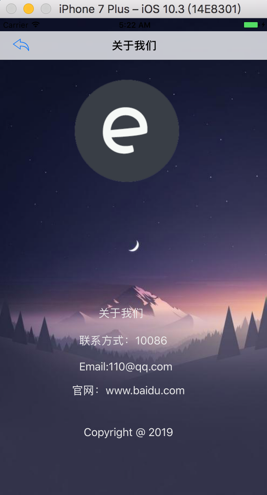

# OneWordCut
## Needed
Xcode 8.3.3+

Swift 3

IOS 8.0+

CoCoPods 1.5.3

## CoCoPods

```ruby
target 'OneWordCut' do 
	use_frameworks! 
	pod 'RealmSwift'
	pod 'SDWebImage', '4.0'
	pod 'Alamofire', '4.4'
	pod 'SwiftyJSON', '4.0'
end

```
## 使用
 
 
 
 
 
 
 

## Install

```shell
git clone https://github.com/Bocity/OneWordCut.git
cd OneWordCut
pod install
```

打开生成的OneWordCut.xcworkspace 即可